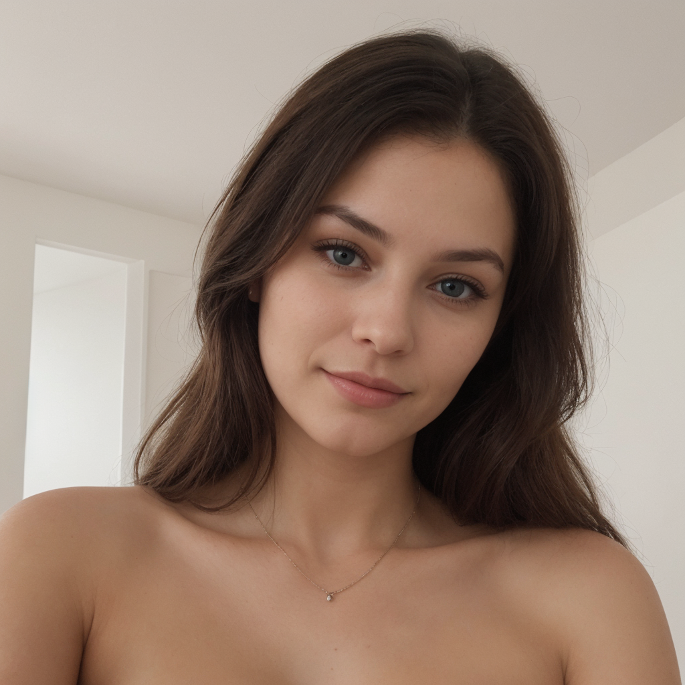

O que é real?
📒 Descrição
Criação da foto de uma pessoa o mais realista possível.

🤖 Tecnologias Utilizadas
Ferramente de instalação local StableDiffusion

Prompt: Photo of a beatiful woman
Steps: 60
Sampler: DPM++ 2M SDE Heun, Schedule type: Karras
CFG scale: 3
Seed: 2078360098
Size: 512x512
Model: epicrealism_pureEvolutionV5

Upscaler: 8x_NMKD-Superscale_150000_G
Size: 512x512 -> 1024x1024
Denoising strength: 0.7
Version: v1.10.1

🚀 Resultados
<br>

<hr>

<br>

💭 Reflexão
Modelos atuais conseguem gerar imagens fotorealistas impressionantes!


<br><br>
<hr>
<br><br>
*Readme original do projeto*

# Natural ou Fake Natty? Como Vencer na Era das IAs Generativas

## 🚀 Introdução

> Woooow! Look at this 👀

Olá pessoal, Venilton da DIO aqui! Inspirado na hype _"Natty or Not"_ do fisiculturismo, este Lab da DIO te convida a conhecer o mundo das IAs Generativas, explorando o potencial dessas tendências tecnológicas incríveis!

## 🎯 Bora Pro Desafio!? Você Já Venceu 💪🤓

### Objetivos

1. **Explorar IAs Generativas**: Utilize essas tecnologias para criar conteúdos que sejam o mais realista possível. Seja criativo! Você pode produzir imagens, textos, áudios, vídeos ou combinações de tudo isso!
1. **Potfólio de Projetos**:
    1. Faça o "fork" deste repositório, criando uma cópia em seu GitHub pessoal;
    2. Edite seu README com os detalhes do seu projeto, siga nosso [Template](#template) (é só copiar, colar e preencher);
    3. Submeta o link do seu repositório na plataforma da DIO. Pronto, você acabou de fortalecer seu portfólio de projetos nos perfis do GitHub e DIO 🚀
1. **Efeito de Rede**: Compartilhe seus resultados nas redes sociais com a hashtag **#LabDIONattyOrNot**. Não esqueça de nos marcar: [DIO](https://www.linkedin.com/school/dio-makethechange) e [falvojr](https://www.linkedin.com/in/falvojr).

### Template

```markdown
# Título do Projeto Extremamente Aesthetic ;)

## 📒 Descrição
Breve descrição do seu projeto

## 🤖 Tecnologias Utilizadas
Liste as IAs Generativas e outras ferramentas usadas

## 🧐 Processo de Criação
Descreva como você criou o conteúdo

## 🚀 Resultados
Apresente os resultados do seu projeto

## 💭 Reflexão (Opcional)
Comente sobre o desafio de criar algo 'natty' com IA.
```

### Exemplos e Insigths

- [E-BOOK](/exemplos/E-BOOK.md)
- [Podcast](/exemplos/PODCAST.md)
- [Vídeo (Avatar Virtual)](/exemplos/VIDEO.md)

## Links Interessantes

[Base10: If You’re Not First, You’re Last: How AI Becomes Mission Critical](https://base10.vc/post/generative-ai-mission-critical/)


